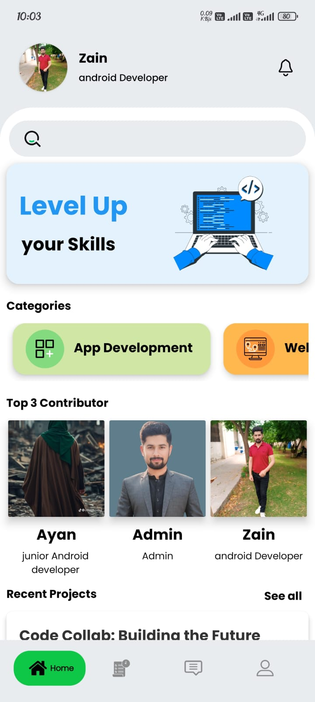
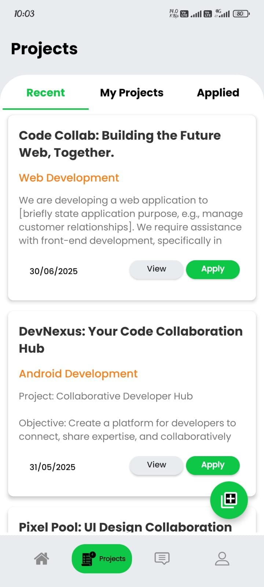
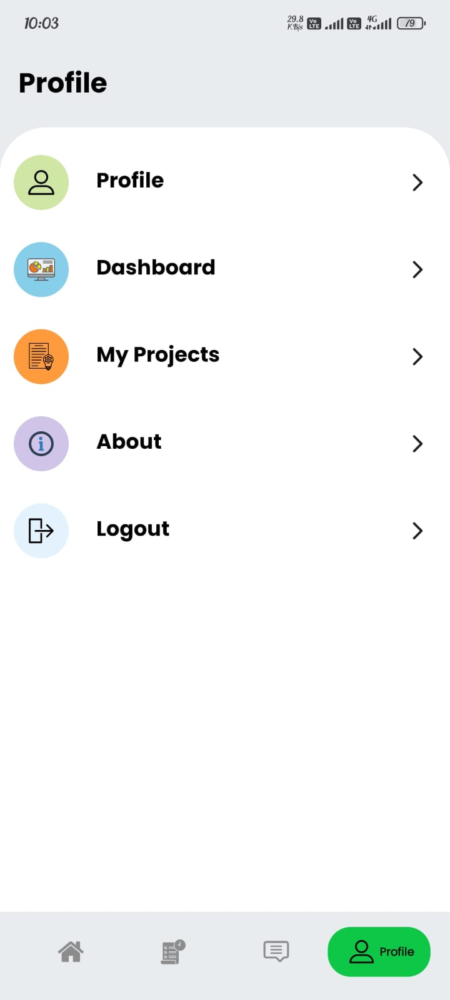
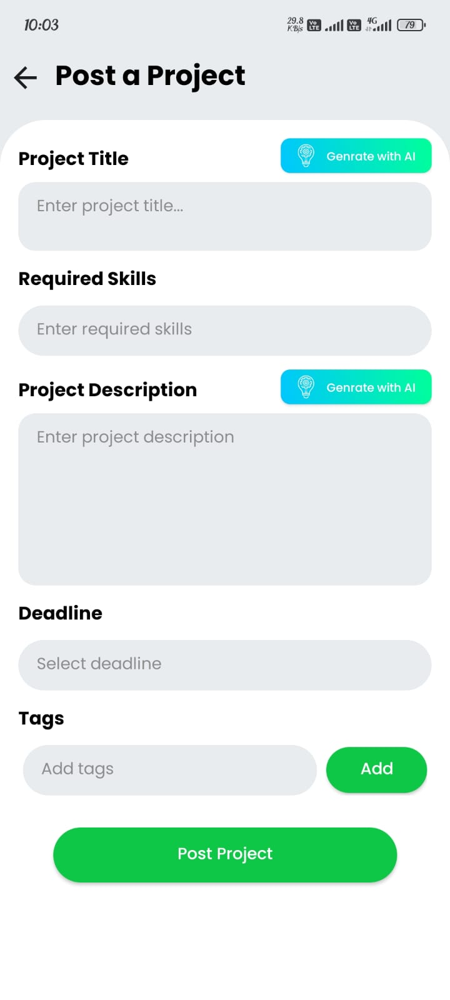

# DevCollab 🤝💻  
**Collaborate. Build. Grow.**

---

## 📱 Overview

**DevCollab** is an innovative Android application built to empower developers by enabling real-time collaboration on projects. Whether you're looking to contribute your skills, join a team, or post your own project — DevCollab helps you connect, communicate, and build software **as a team**.

---

## 🚀 Key Features

- 🔍 **Browse Projects** – Explore open real-world projects across domains.
- 👥 **Join Teams** – Connect with other developers and collaborate instantly.
- 🧑‍💻 **Post Your Project or Job** – Share your idea and build your team.
- ✍️ **AI-Assisted Job Posting** – Use built-in AI to help you write clear and effective project/job posts.
- 💬 **Skill-Based Matching** – Discover teammates based on required skills.
- 📈 **Developer Profiles** – View other developers' skill sets and connect directly.

---

## 🧩 Tech Stack

---

## 📸 Screenshots

> Add your screenshots to the `/screenshots` folder and preview them here.

| Feature | Preview |
|--------|---------|
| Dashboard |  |
| Project Listings |  |
| AI Job Post Writing |  |
| Developer Profile |  |
| Post Screen |  |

---

## 🎯 Motivation

**DevCollab** was developed to bridge the gap between learning and doing. Many aspiring developers struggle to gain practical team-based experience. This app:
- Encourages real-time collaboration  
- Helps build project portfolios  
- Connects like-minded coders  
- Simulates an industry-like teamwork environment  
- Provides **AI-powered assistance** to improve the quality of job/project posts

---

## 🤝 Contributing

We welcome your ideas and code contributions!

1. Fork this repository  
2. Create your branch (`git checkout -b feature-name`)  
3. Commit your changes (`git commit -m 'Add feature'`)  
4. Push to your branch (`git push origin feature-name`)  
5. Open a Pull Request  

---

## 📬 Contact

**Zain Ali**  
🔗 [GitHub](https://github.com/alizain9)  
📧 [LinkedIn](https://www.linkedin.com/in/zain-ali-android-develper/)

---

## 📄 License

This project is licensed under the MIT License.

---

> _Let’s build the future together — one collaboration at a time._
